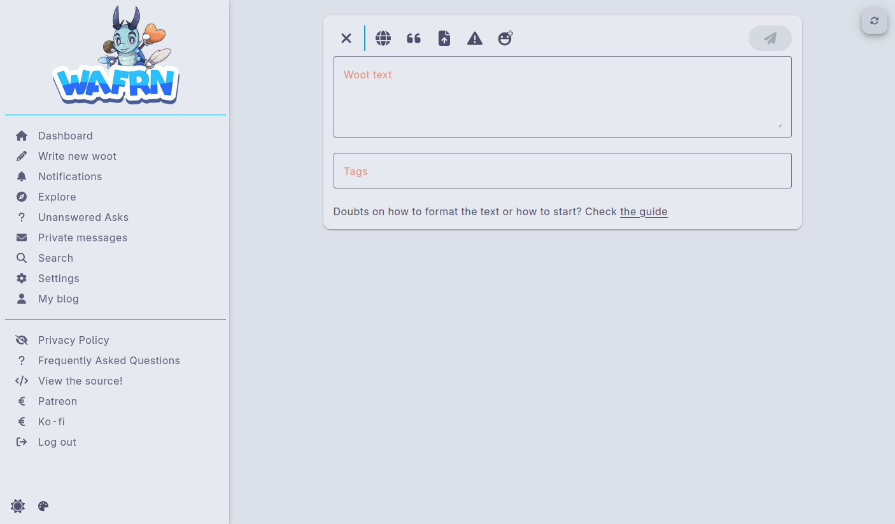
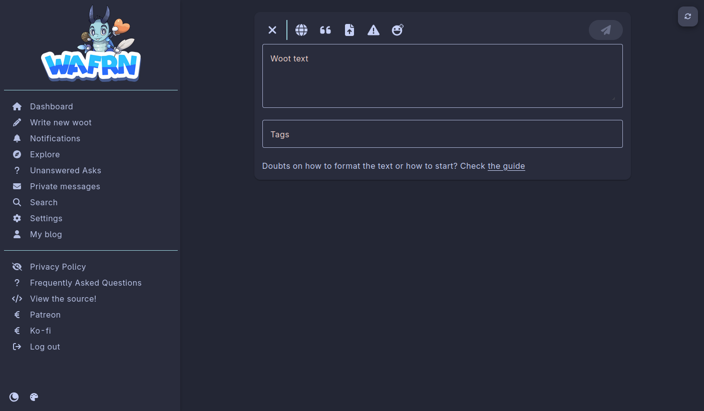
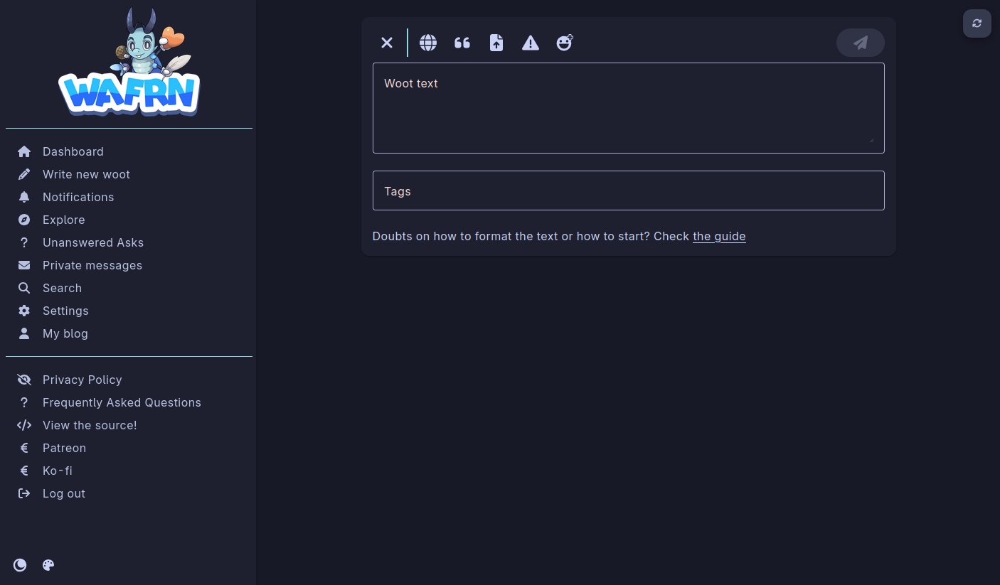
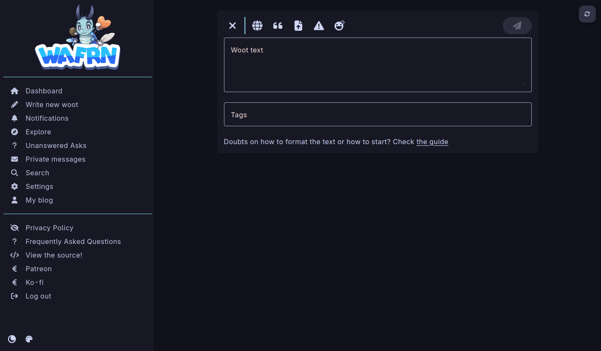

<h3 align="center">
	 
	
	Catppuccin for <a href="https://app.wafrn.net">WAFRN</a>
	
</h3>

	
	
	

	

## Previews

🌻 Latte

🪴 Frappé

🌺 Macchiato

🌿 Mocha

## Usage

There are three methods of using the theme:

1. Select the theme in Wafrn with the Theme Selector

2. insert `@import url('https://raw.githubusercontent.com/astreaprtcl/catppuccin-wafrn/refs/heads/main/src/catppuccin_latte-<flavour>.css');` into the css

3. ~~See [the userstyle usage instructions](https://github.com/catppuccin/userstyles/blob/main/docs/USAGE.md).~~ (the userstyle is currently not working)

## 💝 Thanks to

- [Astreaprtcl](https://github.com/astreaprtcl)

&nbsp;

	

	Copyright &copy; 2021-present <a href="https://github.com/catppuccin" target="_blank">Catppuccin Org</a>

	

